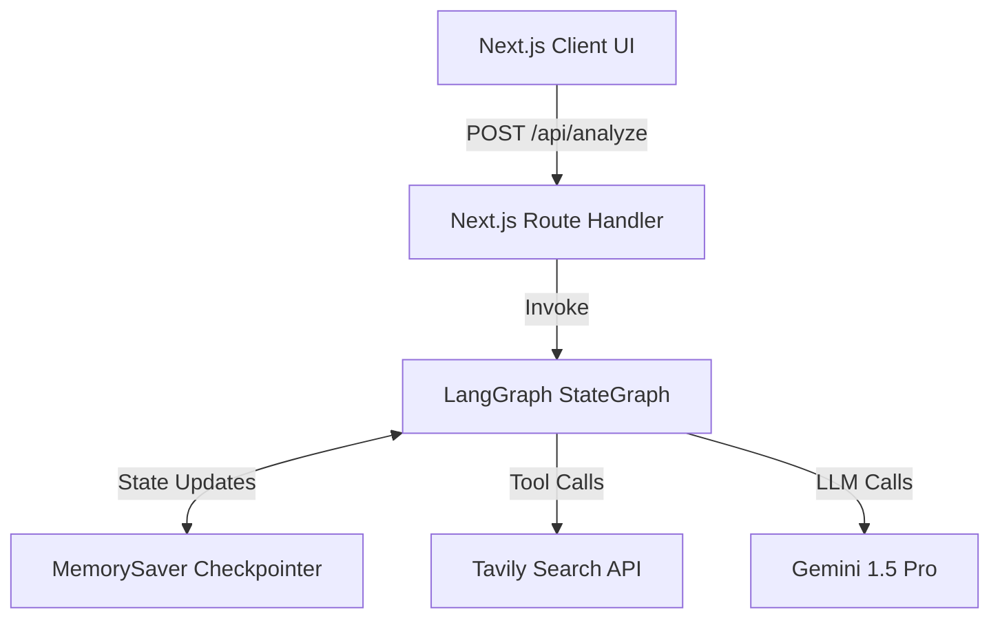
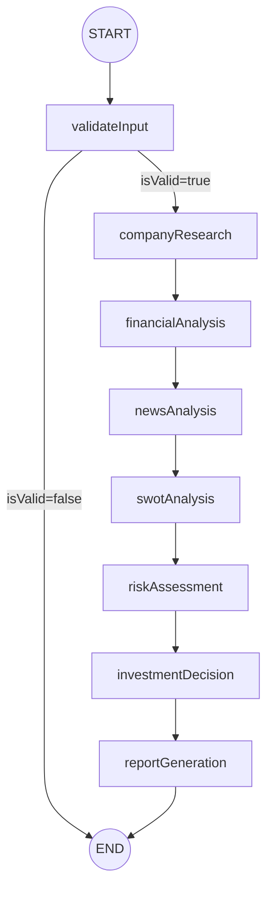

# AI Investment Research Agent

An institutional-grade, autonomous AI investment research platform. Built with Next.js, LangGraph, and Gemini 1.5 Pro, this application accepts a company name and orchestrates a multi-agent workflow to perform deep financial analysis, SWOT evaluation, risk assessment, and news synthesis, culminating in a structured investment recommendation.


## 🚀 Project Overview

The AI Investment Research Agent demonstrates a production-ready application of agentic workflows in the financial domain. Rather than relying on a single, fragile LLM prompt, the application uses **LangGraph** to model the research process as a directed state graph. This allows for parallel execution where appropriate, state accumulation, and deterministic structured outputs using Zod.

### Problem Statement
Traditional retail investment research is fragmented, time-consuming, and prone to cognitive bias. Retail investors often lack access to the institutional-grade synthesis that hedge funds enjoy.

### Solution Approach
This platform democratises institutional research by deploying autonomous AI agents to synthesize live web data (via Tavily) and financial metrics into a coherent, structured, and strictly typed JSON report, which is then rendered on a highly polished, accessible Next.js dashboard.

---

## ✨ Key Features

- **Autonomous Agent Workflow:** Powered by LangGraph for deterministic, stateful execution.
- **Strictly Typed AI Outputs:** Enforced by Zod schemas; the LLM is constrained to output exact JSON structures.
- **Live Market Data:** Integrates with Tavily Search API to pull real-time news and catalysts.
- **Comprehensive Analysis:** Evaluates Financials, SWOT, 9 dimensions of Risk, and Bull/Bear cases.
- **Premium UI/UX:** Built with Tailwind CSS, Framer Motion, and Lucide Icons, featuring glassmorphism, dynamic color theming based on investment verdicts, and staggered animations.
- **Production-Ready:** Includes robust error handling, API retry logic, request cancellation (`AbortController`), semantic HTML, and strict security headers.

---

## 🛠️ Technology Stack

- **Framework:** Next.js (App Router, React 19)
- **AI Orchestration:** LangGraph.js, LangChain.js
- **Model:** Google Gemini 1.5 Pro (`@langchain/google-genai`)
- **Search Tool:** Tavily Search API
- **State Validation:** Zod
- **Styling:** Tailwind CSS, Framer Motion, Lucide React
- **Testing:** Vitest

---

## 📐 Architecture

### System Architecture



### LangGraph Workflow

The core of the application is a directed state graph that orchestrates the research process:



*Note: The workflow executes sequentially to allow downstream nodes (e.g., News) to enrich their analysis using context generated by upstream nodes (e.g., Financials).*

---

## ⚙️ Installation & Local Development

### 1. Clone the repository
```bash
git clone https://github.com/saiiexd/Inside-IIM.git
cd ai-investment-research-agent
```

### 2. Install dependencies
```bash
npm install
```

### 3. Environment Configuration
Copy the example environment file and add your API keys:
```bash
cp .env.example .env.local
```
Required keys:
- `GEMINI_API_KEY`: Get from [Google AI Studio](https://aistudio.google.com/apikey)
- `TAVILY_API_KEY`: Get from [Tavily](https://app.tavily.com)

### 4. Run the development server
```bash
npm run dev
```
Navigate to `http://localhost:3000`.

---

## 🚢 Production Build & Deployment

The application is fully optimized for Vercel deployment.

1. **Build locally:**
   ```bash
   npm run build
   ```
2. **Run tests:**
   ```bash
   npm run test
   ```
3. **Deploy to Vercel:**
   Push your code to GitHub, connect your repository in the Vercel dashboard, and add your `GEMINI_API_KEY` and `TAVILY_API_KEY` to the environment variables section.

---

## 📚 Documentation & Interview Prep

Comprehensive documentation has been prepared to explain every aspect of this project:

- [Project Walkthrough](./docs/PROJECT_WALKTHROUGH.md) - End-to-end explanation of the codebase.
- [Technical Decisions](./docs/TECHNICAL_DECISIONS.md) - Why specific architectural choices were made.
- [Future Improvements](./docs/FUTURE_IMPROVEMENTS.md) - Roadmap for scaling to a production SaaS.
- [Demo Script](./docs/DEMO_SCRIPT.md) - A 3-5 minute live presentation script.
- [Submission Checklist](./docs/CHECKLIST.md) - Verification against assignment requirements.

---

## 🔌 API Documentation

### `POST /api/analyze`

**Request:**
```json
{
  "companyName": "NVIDIA"
}
```

**Success Response (200 OK):**
Returns a heavily typed JSON object conforming to the `FinalReport` Zod schema.

**Error Response (422 Unprocessable Entity):**
```json
{
  "error": "Company validation failed.",
  "details": ["Could not locate a publicly traded company matching 'UnknownCorp'."]
}
```

---

## 🤝 Acknowledgements

Developed as a technical assignment for the AI Product Development Engineer Internship at Altuni AI Labs.
